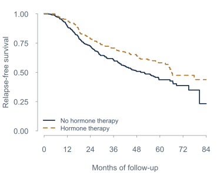

::::: {.home-hero}
:::: hero-copy
::: eyebrow
An applied guide in R
:::

# Tidy Survival Analysis {.unnumbered}

::: intro
Learn survival analysis in R—and turn your results into clear figures and polished tables with tidy tools. Follow a reproducible workflow from data preparation and modeling to reporting.
:::

::: byline
[Lu Mao](https://lmaowisc.github.io/){target="_blank" rel="noopener noreferrer"}, PhD\
[University of Wisconsin–Madison]{.affiliation}
:::

::: hero-actions
[Start reading →](intro.qmd){.button}
[Explore the chapters](#chapters){.button .button-secondary}
:::
::::

:::: hero-figure
::: figure-label
ONE DATASET. CLEAR FIGURES AND TABLES.
:::



::: figure-caption
Survival curves show the pattern over time. Regression tables make the model's estimates easy to read.
:::

::: cover-results
### A model, ready to report {.unnumbered}

```{r}
#| label: cover-cox-table
#| echo: false
#| results: asis
library(survival)
cover_data <- read.table("data/gbc.txt", header = TRUE)
cover_data <- cover_data[order(cover_data$id, cover_data$time,
                               cover_data$status == 0), ]
cover_data <- cover_data[!duplicated(cover_data$id), ]
cover_data$event <- as.integer(cover_data$status > 0)
cover_data$hormone <- factor(cover_data$hormone, levels = c(1, 2),
                              labels = c("No", "Yes"))
cover_data$meno <- factor(cover_data$meno, levels = c(1, 2),
                           labels = c("Pre", "Post"))
cover_data$grade <- factor(cover_data$grade, levels = c(1, 2, 3),
                            labels = c("I", "II", "III"))
cover_fit <- coxph(
  Surv(time, event) ~ hormone + meno + age + grade + size + prog + estrg,
  data = cover_data
)
terms <- c("hormoneYes", "age", "size")
units <- c(1, 10, 10)
hr <- exp(coef(cover_fit)[terms] * units)
ci <- exp(confint(cover_fit)[terms, ] * units)
cover_table <- data.frame(
  Characteristic = c("Hormone therapy: yes vs no", "Age: per 10 years",
                     "Tumor size: per 10 mm"),
  HR = sprintf("%.2f", hr),
  `95% CI` = sprintf("%.2f&ndash;%.2f", ci[, 1], ci[, 2]),
  check.names = FALSE
)
knitr::kable(cover_table, row.names = FALSE, align = c("l", "r", "r"))
```

::: table-note
Selected adjusted Cox estimates · HR = hazard ratio; CI = confidence interval. From the [Chapter 1 example](intro.qmd#fit-and-interpret-a-cox-model), with 686 patients and 299 events; interpretation and model checks accompany the analysis.
:::
:::
::::
:::::

::::: reader-note
:::: reader-column
## Where to begin {.unnumbered}

A little R is enough to start. Survival concepts are introduced through examples, and the tidyverse is explained from the beginning.
::::
:::: reader-column
## How to use this book {.unnumbered}

Read alongside the R examples, try the exercises, and use the companion slides to revisit the main ideas. Code and data are available to download.
::::
:::::

## The chapters {#chapters .unnumbered}

::: chapter-list
:::: chapter-row
::: num
01
:::
::: chapter-text
### [Survival Analysis in Base R](intro.qmd) {.unnumbered}

Censoring, survival curves, regression, prediction, and diagnostics using the standard `survival` package.
:::
::: row-links
[Read](intro.qmd) [Slides ↗](slides/Module%201.pdf){target="_blank"}
:::
::::

:::: chapter-row
::: num
02
:::
::: chapter-text
### [Working with Tidy Survival Data](tidy.qmd) {.unnumbered}

Meet the tidyverse. Prepare survival data, visualize follow-up, and build a descriptive table.
:::
::: row-links
[Read](tidy.qmd) [Slides ↗](slides/Module%202.pdf){target="_blank"}
:::
::::

:::: chapter-row
::: num
03
:::
::: chapter-text
### [Nonparametric methods](np.qmd) {.unnumbered}

Turn survival estimates and competing-risk analyses into clear tables and graphics.

[Companion slides & code · narrative chapter forthcoming]{.stage}
:::
::: row-links
[Explore](np.qmd) [Slides ↗](slides/Module%203.pdf){target="_blank"}
:::
::::

:::: chapter-row
::: num
04
:::
::: chapter-text
### [Regression models](reg.qmd) {.unnumbered}

Tidy Cox and Fine–Gray model results, communicate associations, and examine model assumptions.

[Companion slides & code · narrative chapter forthcoming]{.stage}
:::
::: row-links
[Explore](reg.qmd) [Slides ↗](slides/Module%204.pdf){target="_blank"}
:::
::::

:::: chapter-row
::: num
05
:::
::: chapter-text
### [Machine learning](ml.qmd) {.unnumbered}

Build and evaluate survival prediction models with `tidymodels` and `censored`.

[Companion slides & code · narrative chapter forthcoming]{.stage}
:::
::: row-links
[Explore](ml.qmd) [Slides ↗](slides/Module%205.pdf){target="_blank"}
:::
::::
:::

::: origin-note
This book grows from the June 2025 short-course materials. The original slides remain available as companions to the developing text. [Find the code, data, and slides →](resources.qmd)
:::
