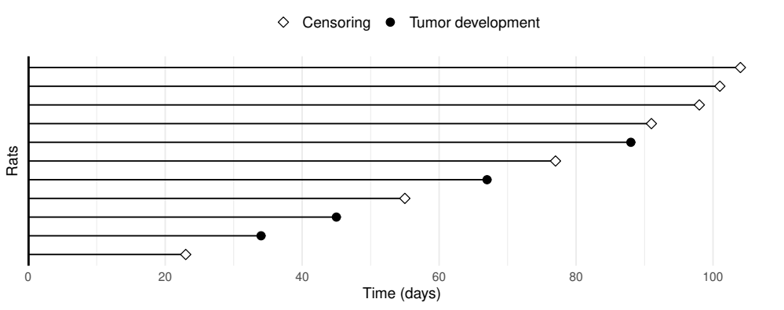

::: chapter-tools
[Companion slides ↗](slides/Module%201.pdf){target="_blank"} · [Download R code](code/chapter-1.R){download="chapter-1.R"} · [Data & setup](resources.qmd)
:::

Survival analysis concerns the time until an event, such as relapse or death. Follow-up often ends before the event is observed for every participant: some remain event-free at the study end, while others leave earlier. The analysis must account for these incomplete observations while using the information available for each participant.

A standard survival analysis involves defining the outcome, estimating survival curves, comparing groups, fitting regression models, and checking their assumptions. Base R and the `survival` package provide the tools for these tasks, without requiring tidyverse knowledge.

The standard tools produce usable preliminary results, including console summaries, basic plots, and fitted model objects. Understanding these results is essential for interpreting the estimates and assessing the analysis. Their default presentation often requires additional formatting before inclusion in a report.

Tidy survival tools build on the same statistical methods while simplifying data preparation, extraction of model results, and production of clear figures and tables. A consistent workflow reduces repeated manual formatting and makes reports easier to update when the data or analysis change.

Run the examples in order from the RStudio project folder so that the data paths and objects are available to subsequent commands.

## Survival outcomes and basic concepts {#basics-of-survival-analysis}

### A time origin, an event, and an end to observation

Before choosing a method, specify when the clock starts and what stops it. For overall survival, the origin might be the date of diagnosis and the event is death. For relapse-free survival, the event might be the first of relapse or death. These are different outcomes, even when constructed from the same patient records.

A participant whose event is observed contributes an event time. A participant whose event has not been observed contributes a shorter statement: the event time exceeds the time of last observation. We call the latter observation **right censored**. Someone followed for 32 months without an event has not demonstrated that their event time is 32 months. They have demonstrated that it is longer than 32 months.

Censoring therefore carries information. We should neither discard a censored participant nor count the censoring time as an event. We also should not treat that person as permanently event-free. Survival methods retain their contribution for the period during which their event status is known.

Let $T$ be the event time and $C$ the censoring time. We observe

$$
X = \min(T,C), \qquad \delta = I(T \leq C).
$$

The indicator $I(\cdot)$ equals one when its argument is true and zero otherwise. The pair $(X,\delta)$ records both the length of observation and how it ended. In R, we will usually call these columns `time` and `event`, or `time` and `status`.

### A small example

Consider five people followed from the same kind of starting point. We can create their records with `data.frame()`, which assembles columns into a rectangular dataset.

```{r}
#| label: small-follow-up-data
small <- data.frame(
  id = 1:5,
  time = c(5, 3, 8, 2, 6),
  status = c(1, 0, 1, 0, 1)
)
small
```

The first person had an event at time 5. The second was observed until time 3 without an event, so their event time is greater than 3. The fourth was censored at time 2. The event-free information contributed by these two people is shorter, but still useful.

The function `Surv()` keeps the two parts of each observation together. Load the package once in the current R session, then pass it the time and event-indicator columns. The `$` operator selects a named column from a data frame.

```{r}
#| label: small-survival-object
library(survival)
Surv(small$time, small$status)
```

The printed result is `5 3+ 8 2+ 6`. The plus sign marks censoring; it does not mean that we should add anything to the time. This compact display represents the same five pairs of numbers in `small`. Here, `1` means an observed event and `0` means censoring. Other datasets use other conventions, so checking the dictionary comes before constructing a survival object.

A follow-up plot makes the distinction visible. Each horizontal line below represents one subject's observed follow-up; its endpoint symbol distinguishes an event from censoring. The absence of an event at a line's endpoint does not tell us what happened afterward.

{fig-align="center" width="85%"}

### The assumption behind using censored observations

The usual methods require censoring to be uninformative about future event risk after accounting for the variables used in the analysis. Informally, among comparable people still being followed at a given time, those censored then should not systematically have different subsequent event prospects from those who remain under observation.

A planned study end can make this assumption plausible. Withdrawal caused by worsening health may make it doubtful. The observed data alone generally cannot establish the assumption: the outcomes needed to check it are unobserved after censoring. Knowing how follow-up was collected is part of knowing what the analysis means.

### The quantities we want to describe {#the-quantities-we-want-to-describe}

The **survival function** answers a probability question:

$$
S(t) = \Pr(T > t).
$$

For example, $S(36)=0.70$ means a 70% probability of remaining free of the defined event beyond 36 time units. If relapse or death is the event, the curve describes remaining alive and relapse-free; it is not an overall-survival curve.

The **hazard** asks a different question. Among people who have reached time $t$ without an event, how quickly are events occurring at that time? For a continuous event time,

$$
\lambda(t) = \lim_{\Delta t \to 0}
\frac{\Pr(t \leq T < t+\Delta t \mid T \geq t)}{\Delta t}.
$$

The fraction restricts attention to people still event-free and considers a short interval ahead. Dividing by the interval length produces a rate. A hazard is not a probability and need not lie between zero and one. When time is measured in months, it is a rate per month among those still at risk.

The **cumulative hazard**, $\Lambda(t)=\int_0^t \lambda(u)\,du$, accumulates that rate. For a continuous event-time distribution, $S(t)=\exp\{-\Lambda(t)\}$. It explains why survival probabilities and hazards both appear in the software: they describe the same distribution from different perspectives.

Keep the interpretation attached to the quantity. A survival probability concerns remaining event-free up to a specified time. A hazard ratio compares event rates among those still event-free. It is not a ratio of survival probabilities.

## Meet the working data {#german-breast-cancer-study}

The supplied German breast cancer (GBC) analysis files contain records for 686 patients with node-positive breast cancer. The [data dictionary](data/Readme_gbc.txt) describes their provenance and coding; the original study recruited a larger group.

Place the files in a folder called `data` inside your RStudio project. With that project open, these paths are relative to its folder. `header = TRUE` tells `read.table()` to read column names from the first line.

```{r}
#| label: read-gbc
mortality <- read.table("data/gbc_mort.txt", header = TRUE)
gbc <- read.table("data/gbc.txt", header = TRUE)
head(mortality[, c("id", "time", "status", "hormone", "age")])
```

The square brackets select rows and columns. A blank before the comma means all rows; the vector after it names the columns to retain. `head()` shows just the first six rows, keeping the output manageable.

| File | What a row records | Meaning of `status` |
|:---|:---|:---|
| `gbc_mort.txt` | One patient's death or last mortality follow-up | 0 = censored; 1 = death |
| `gbc.txt` | A relapse, death, or censoring record; patients can have multiple records | 0 = censored; 1 = relapse; 2 = death |

The baseline variables also need interpretation. `hormone` is coded 1 for no hormone therapy and 2 for hormone therapy; `meno` is coded 1 for premenopausal and 2 for postmenopausal. `age` is in years, `size` in millimeters, and `grade` takes values 1, 2, or 3. `nodes` counts positive lymph nodes. `prog` and `estrg` record progesterone and estrogen receptor levels.

A few checks help us avoid counting records as people.

```{r}
#| label: gbc-dimensions
c(
  mortality_rows = nrow(mortality),
  event_history_rows = nrow(gbc),
  patients = length(unique(gbc$id)),
  observed_deaths = sum(mortality$status == 1)
)
```

There are 686 mortality records but 985 event-history records, representing the same 686 patients. The mortality file contains 171 observed deaths. `unique(gbc$id)` extracts distinct patient identifiers, and `length()` counts them. In contrast, `nrow(gbc)` counts every record, including later records from the same patient.

Inspecting one history makes the distinction concrete.

```{r}
#| label: one-patient-history
gbc[gbc$id == 3, c("id", "time", "status")]
```

Patient 3 has a relapse at about 41.9 months and a death at about 47.7 months. For overall survival, the latter time matters. For relapse-free survival, the event already happened at the earlier time. Counting both rows as independent patients would change the analysis for a purely clerical reason.

### Build one record per patient {#build-one-record-per-patient}

The outcome for this analysis is time to **first relapse or death**. Each patient contributes one observation, ending at that first event or at the last known event-free time. We create a separate object, `rfs`, leaving the source data available for other questions.

```{r}
#| label: construct-rfs
ordered_records <- gbc[order(gbc$id, gbc$time, gbc$status == 0), ]
rfs <- ordered_records[!duplicated(ordered_records$id), ]
rfs$event <- as.integer(rfs$status > 0)
head(rfs[, c("id", "time", "status", "event")])
```

Read this in three steps:

1. `order(gbc$id, gbc$time, gbc$status == 0)` sorts first by patient, then by time. Its third argument places an event before a censoring record when their times tie, because `FALSE` sorts before `TRUE`.
2. `!duplicated(ordered_records$id)` retains each patient's first record. `duplicated()` marks identifiers already encountered; `!` reverses that result. The blank after the comma keeps all columns.
3. `as.integer(rfs$status > 0)` creates the event indicator. The comparison asks whether either event occurred, and `as.integer()` converts `TRUE` and `FALSE` into 1 and 0.

The tie rule suffices for this composite because either event ends relapse-free survival. It does not establish which event type occurred first when two types share a recorded time. A competing-risk analysis needs its own outcome rules.

```{r}
#| label: check-rfs
c(patients = nrow(rfs), events = sum(rfs$event))
anyDuplicated(rfs$id)
```

The result is 686 patients and 299 first events. Zero from `anyDuplicated()` confirms that identifiers are not repeated. The event count exceeds the death count because our composite includes relapse. These are observed counts, not estimated probabilities at a common follow-up time.

We also label the categorical variables. A **factor** tells R to treat a column as categories and records their order.

```{r}
#| label: label-rfs
rfs$hormone <- factor(rfs$hormone, levels = c(1, 2),
                      labels = c("No", "Yes"))
rfs$meno <- factor(rfs$meno, levels = c(1, 2),
                   labels = c("Pre", "Post"))
rfs$grade <- factor(rfs$grade, levels = c(1, 2, 3),
                    labels = c("I", "II", "III"))
table(rfs$hormone, rfs$event)
```

The reference levels are now explicit: no hormone therapy, premenopausal status, and grade I. Treating grade as a factor allows separate comparisons of grades II and III with grade I. Leaving it numerical in a regression would impose an equal change in log hazard for each one-grade increase.

::: {.callout-note collapse="true"}
## Exercise: change the outcome {.unnumbered}

Which file would you use to count observed deaths? Why would `sum(rfs$event)` answer a different question?

The mortality file has one record per patient and codes death as `status = 1`. The `event` column in `rfs` also includes relapse. A matching command is:

```{r}
#| label: mortality-exercise
sum(mortality$status == 1)
```
:::

## Estimate survival and compare groups {#standard-analysis-with-the-survival-package}

### Fit a Kaplan–Meier curve

The Kaplan–Meier estimator follows the group through successive event times. At each event time it compares the number of events with the number still under observation and event-free just before that time—the **risk set**. It combines these conditional survival proportions to estimate survival from the origin.

If five people are at risk and one event occurs, the estimated fraction surviving that step is $4/5$. If someone is subsequently censored, the curve does not jump at censoring, but later risk sets become smaller. This is how incomplete follow-up contributes without being counted as a failure time.

We ask `survfit()` for separate curves by hormone-therapy group:

```{r}
#| label: fit-km
km_fit <- survfit(Surv(time, event) ~ hormone, data = rfs)
km_fit
```

The expression around `~` is an R **formula**. Read the call in three parts:

- `Surv(time, event)` supplies follow-up time and the event indicator on the left of the formula.
- `~ hormone` requests a separate curve for each hormone-therapy group. Use `~ 1` for one curve combining all patients.
- `data = rfs` tells R where to find these variables, so we do not need to repeat `rfs$` before each name.

The assignment stores a fitted object in `km_fit`. Printing it gives group sizes, observed events, and estimated median survival. Here *median survival* means the time when the estimated survival curve reaches 0.5. It is not the median of the observed `time` column, which mixes event and censoring times. An `NA` for a median or confidence limit can mean that the relevant curve never reaches 0.5 during follow-up.

### Ask about specific times

A question about survival at one, three, and five years corresponds to 12, 36, and 60 months in our data.

```{r}
#| label: km-landmarks
summary(km_fit, times = c(12, 36, 60))
```

Start with `time` and `survival`. At 36 months, estimated relapse-free survival is about 0.606 in the no-hormone group and 0.708 in the hormone group: an unadjusted difference of about 10 percentage points in the probability of remaining alive and relapse-free beyond three years.

`n.risk` counts patients still contributing to the risk set at the stated time. The standard error and confidence limits describe uncertainty in the survival estimate. With successive requested times, `n.event` reports event counts over the intervals between them, including the first interval from the origin. It does not mean events occurred exactly at 12, 36, or 60 months.

Risk sets shrink with follow-up. A late estimate based on few patients deserves more caution than an early estimate based on most of the sample. Confidence intervals communicate sampling uncertainty, but do not repair informative censoring or a poorly defined outcome.

### Make a first plot

Base R already gives us a useful survival plot. We supply labels and line styles so the reader need not translate numerical treatment codes.

```{r}
#| label: fig-standard-km
#| fig-width: 8
#| fig-height: 5
#| fig-cap: "Kaplan–Meier relapse-free survival estimates. Fine lines give pointwise 95% confidence limits; tick marks indicate censoring."
plot(km_fit,
     xlab = "Months since study entry",
     ylab = "Relapse-free survival probability",
     ylim = c(0, 1),
     col = c("#172d49", "#b0772b"), lty = c(1, 2),
     lwd = 2, conf.int = TRUE, mark.time = TRUE)
legend("bottomleft", legend = c("No hormone therapy", "Hormone therapy"),
       col = c("#172d49", "#b0772b"), lty = c(1, 2), lwd = 2,
       bty = "n")
```

The curves descend at events and remain level between them. Censoring marks do not cause downward steps. The hormone-therapy curve generally lies above the other curve, indicating better estimated relapse-free survival in that group. This describes a contrast before adjustment for baseline characteristics; it does not explain why the groups differ.

The plotting arguments control different parts of this preliminary display:

- `xlab` and `ylab` name the axes; `ylim = c(0, 1)` fixes the probability scale.
- `col` and `lty` supply colors and line types in group order. Here, line types 1 and 2 mean solid and dashed. `lwd = 2` sets line thickness.
- `conf.int = TRUE` adds confidence limits, and `mark.time = TRUE` marks censoring times.
- `legend()` adds the key separately. Repeating the colors and line types keeps it consistent with the curves; `bty = "n"` removes its border.

This plot is useful for checking the analysis. Preparing a figure for a report may also require a risk table, more control over labels, and a consistent style across analyses. The tidy plotting tools introduced later make these reporting tasks easier to combine.

The confidence limits are pointwise, concerning a given time rather than simultaneous coverage of the entire curve.

### Compare groups with a log-rank test {#compare-groups-with-a-log-rank-test}

The curves suggest a difference. A log-rank test provides a formal comparison across follow-up. At each event time it compares events observed in each group with those expected if the groups had the same event-time distribution, given the risk sets. It then combines those comparisons.

```{r}
#| label: logrank
logrank_fit <- survdiff(Surv(time, event) ~ hormone, data = rfs)
logrank_fit
```

The hormone group has fewer events than expected under the null comparison: 94 observed versus about 119 expected. The no-hormone group has the complementary excess. The chi-squared statistic is about 8.6 on one degree of freedom, with a p-value near 0.003. This is evidence against equal survival distributions under the test's assumptions.

A p-value does not measure the size of the difference; the survival estimates at meaningful times do that more directly. Nor is this an adjustment for age, grade, or other characteristics. The test is often informative when hazards differ consistently over time; opposing differences in different periods can partly cancel. Read the curves along with the test.

If we need the p-value as a separate R object, we can calculate it from the test statistic and number of groups:

```{r}
#| label: logrank-pvalue
pchisq(logrank_fit$chisq,
       df = length(logrank_fit$n) - 1,
       lower.tail = FALSE)
```

`lower.tail = FALSE` asks for the probability of a chi-squared value at least as large as the observed statistic. This illustrates a recurring pattern: printed output summarizes a richer R object, and `$` retrieves named pieces of that object.

::: {.callout-note collapse="true"}
## Exercise: compare within menopausal groups {.unnumbered}

Use a stratified log-rank test to compare hormone groups within menopausal-status strata.

```{r}
#| label: stratified-logrank
survdiff(Surv(time, event) ~ hormone + strata(meno), data = rfs)
```

`strata(meno)` forms comparisons separately within menopausal groups before combining them. It does not test a menopausal-status coefficient. It also differs from making four treatment-by-menopause groups and testing all four together.
:::

## Cox regression and prediction {#fit-and-interpret-a-cox-model}

### Move from group comparisons to covariates

A Cox model relates the event rate to several explanatory variables at once:

$$
\lambda(t \mid Z) = \lambda_0(t)\exp(\beta^T Z).
$$

The baseline hazard $\lambda_0(t)$ describes the time pattern for the reference covariate values. The remaining term multiplies that hazard according to the covariates. The model leaves the baseline time pattern unspecified but assumes that the hazard ratio for a fixed covariate contrast does not change with time. This is the **proportional hazards** assumption.

We fit an illustrative model using the covariates in the course example. It is a starting point for learning the workflow, not the result of a complete model-building exercise. For example, the dataset also contains node counts, which are not included in this particular formula.

```{r}
#| label: fit-cox
cox_fit <- coxph(
  Surv(time, event) ~ hormone + meno + age + grade + size + prog + estrg,
  data = rfs, x = TRUE
)
summary(cox_fit)
```

The `+` signs include separate model terms; they do not request interactions. `x = TRUE` retains the model matrix for diagnostic calculations. The summary reports 686 observations and 299 events. In other datasets these counts may be reduced by missing covariates, so compare them with the intended analysis sample.

### Read the coefficient table

The `coef` column contains estimated log hazard ratios. `exp(coef)` exponentiates them to obtain hazard ratios, with one as the reference for no association. The coefficient's standard error, test statistic, and p-value describe uncertainty and a test of a zero log hazard ratio.

The row `hormoneYes` compares hormone therapy with the reference level `No`, at the same modeled values of the other covariates. Its hazard ratio is about 0.70, with a 95% confidence interval of about 0.54 to 0.90. Under this fitted model, the hormone group has an estimated event rate about 30% lower among otherwise comparable patients who remain event-free. This is an adjusted association. It is neither a 30-percentage-point increase in survival nor, by this calculation alone, proof of a causal treatment effect.

The grade rows compare grades II and III separately with grade I. This differs from treating grade as a numerical score and imposing the same step from I to II as from II to III.

Units matter for continuous covariates. The size hazard ratio concerns a one-millimeter increase; the age hazard ratio concerns a one-year increase. For a ten-millimeter size comparison, multiply its log hazard coefficient by ten before exponentiating:

```{r}
#| label: size-contrast
exp(10 * coef(cox_fit)["size"])
```

The result is about 1.17: a ten-millimeter larger tumor is associated with roughly a 17% higher hazard, conditional on the other terms and on the linear specification for size. Selecting the coefficient by `["size"]` makes the intention explicit without relying on its position in a table.

To extract all hazard ratios and confidence intervals without copying console output, use:

```{r}
#| label: extract-cox-results
round(cbind(
  hazard_ratio = exp(coef(cox_fit)),
  exp(confint(cox_fit))
), 3)
```

The columns place estimates and limits together. `round()` changes printed precision, not the fitted model.

### Obtain predicted survival probabilities {#obtain-predicted-survival-probabilities}

A hazard ratio is a relative comparison. To estimate three-year relapse-free survival for a particular profile, we also need the estimated baseline survival and specified covariates.

Create a data frame with one profile. Its names must match the model variables, and its factor levels must be consistent with the fitted data.

```{r}
#| label: prediction-profile
new_patient <- data.frame(
  hormone = factor("No", levels = levels(rfs$hormone)),
  meno = factor("Pre", levels = levels(rfs$meno)),
  age = 45,
  grade = factor("II", levels = levels(rfs$grade)),
  size = 20,
  prog = 100,
  estrg = 100
)
new_patient
```

This is a hypothetical profile, not an “average patient” automatically supplied by R. Making it explicit lets someone else understand and reproduce the prediction. Different profiles produce different curves.

We use `survfit()` again, now supplying a fitted Cox model and `newdata`. The same function name serves different tasks because R selects a method appropriate to the supplied object.

```{r}
#| label: cox-prediction
predicted_survival <- survfit(cox_fit, newdata = new_patient)
summary(predicted_survival, times = c(12, 36, 60))
```

The `times` argument in `summary()` chooses points to report from the predicted curve. Read its survival and confidence-limit columns as model-based estimates for people with this profile, not guarantees about an individual's future. The risk-set and event counts shown here arise from the fitted data; they are not counts of people with exactly these covariates.

At 36 months, the estimated probability of remaining alive and relapse-free is about 0.673, with a 95% confidence interval from 0.612 to 0.740. We could describe this as an estimated three-year relapse-free survival of 67% for the specified profile. The interval reflects uncertainty in that estimated probability; it is not a range of possible survival times for this person.

```{r}
#| label: fig-cox-prediction
#| fig-width: 8
#| fig-height: 5
#| fig-cap: "Model-based relapse-free survival for the specified profile, with pointwise confidence limits."
plot(predicted_survival,
     xlab = "Months since study entry",
     ylab = "Predicted relapse-free survival probability",
     ylim = c(0, 1), col = "#172d49", lwd = 2,
     conf.int = TRUE)
```

The earlier Kaplan–Meier curves summarized observed treatment groups without covariate adjustment. This curve comes from a regression model for a chosen profile. Its interpretation depends on the model being adequate, which brings us to diagnostics.

## Check what the model assumes

### Does a covariate's association change over time?

The Cox model allows the baseline hazard to change with time. Proportional hazards does not require a constant event rate; it requires a fixed covariate contrast to multiply that changing rate by the same factor throughout follow-up.

`cox.zph()` checks for time-related changes in coefficients using scaled Schoenfeld residuals. Its printed result gives a test for each term and a joint test labeled `GLOBAL`.

```{r}
#| label: ph-test
ph_test <- cox.zph(cox_fit)
ph_test
```

For this fit the global p-value is about 0.003. Several terms, including age and grade, show evidence of departures from a constant coefficient. The hormone term does not show comparable evidence, but that alone does not validate the model or prove a constant hazard ratio.

Plots reveal patterns that a p-value cannot show. Compare the hormone and age terms:

```{r}
#| label: fig-ph-diagnostics
#| fig-width: 9
#| fig-height: 4.5
#| fig-cap: "Coefficient patterns over time for hormone therapy and age. A horizontal pattern is consistent with proportional hazards."
old_par <- par(mfrow = c(1, 2))
plot(ph_test, var = 1, se = TRUE, col = "#172d49")
plot(ph_test, var = 3, se = TRUE, col = "#172d49")
par(old_par)
```

The term order follows the diagnostic table. The smooth curves estimate how the coefficients vary over time. Under proportional hazards their underlying patterns would be horizontal, though not necessarily at zero. Uncertainty bands help distinguish a trend from a noisy fluctuation, especially near the ends of follow-up. These are coefficient diagnostics, not survival curves.

### Is a straight-line covariate effect reasonable?

A separate assumption concerns the covariate scale. Writing `+ age` gives age a linear association with log hazard. This is different from assuming that age's effect is constant over time: one assumption concerns variation across ages, the other variation across follow-up times.

An exploratory view plots martingale residuals from a model omitting age against age itself. Each residual contrasts the observed event indicator with the cumulative hazard expected from the fitted model over that person's observed follow-up. These residuals are asymmetric, so we seek a broad pattern rather than normally distributed errors.

```{r}
#| label: fig-age-residuals
#| fig-width: 8
#| fig-height: 5
#| fig-cap: "Exploring the age pattern with martingale residuals from a model without age."
fit_without_age <- update(cox_fit, . ~ . - age)
m <- residuals(fit_without_age, type = "martingale")
plot(rfs$age, m,
     xlab = "Age at diagnosis (years)",
     ylab = "Martingale residual", pch = 16,
     col = grDevices::adjustcolor("#172d49", alpha.f = 0.35))
lines(lowess(rfs$age, m), col = "#925415", lwd = 2)
abline(h = 0, lty = 3, col = "grey50")
```

`update()` refits the earlier model after removing age. The dots mean “retain the corresponding parts of the previous formula.” `lowess()` adds a smooth exploratory trend. Curvature can motivate a more flexible age term, but this plot does not directly estimate age-specific hazard ratios or identify a unique transformation. Other misspecified terms and covariate distributions also influence it.

One possible revision uses a natural spline for age and stratifies the baseline hazard by grade:

```{r}
#| label: revise-cox
revised_fit <- coxph(
  Surv(time, event) ~ hormone + meno + splines::ns(age, df = 3) +
    size + prog + estrg + strata(grade),
  data = rfs, x = TRUE
)
cox.zph(revised_fit)
```

`splines::` identifies the package providing `ns()`. This term represents age with a smooth curve using three basis functions, allowing more flexibility than one straight-line coefficient. `strata(grade)` gives each grade its own baseline hazard, so there is no longer a grade hazard-ratio coefficient to report.

This illustrates available tools rather than an automatic repair. A spline addresses age's functional form, not a time-varying age effect. The revised diagnostics still need examination, and departures may remain. Arbitrarily splitting age at a cutoff would lose information and would not, by itself, solve either diagnostic problem.

## From preliminary results to tidy reporting {#summary}

A first-event dataset links the outcome definition to the analysis: `Surv()` represents the observations, `survfit()` estimates curves, `survdiff()` compares groups, and `coxph()` allows covariate adjustment. Predicted probabilities describe outcomes for specified profiles, while diagnostics assess the assumptions underlying those predictions.

Console summaries and base R plots support preliminary interpretation and model checking. Preparing results for a report also requires selecting coefficients, exponentiating estimates and confidence limits, assigning descriptive labels, and coordinating graphical settings. Repeating these steps manually across several analyses increases the work required to maintain consistent output.

Tidy survival tools organize these tasks into a consistent workflow connecting data, fitted models, and presentation. Their usefulness depends on retaining the outcome definitions and diagnostic checks underlying the analysis. The data operations, graphics, and descriptive tables introduced in [Chapter 2](tidy.qmd) provide the main components of this workflow.

The [downloadable R script](code/chapter-1.R) contains the code in reading order. Start it from the project folder with the `data` directory available, and read its results alongside the explanations here.

### Documentation for further study {.unnumbered}

See the package documentation for [`Surv()`](https://stat.ethz.ch/R-manual/R-devel/library/survival/html/Surv.html), [Cox-model survival predictions](https://stat.ethz.ch/R-manual/R-devel/library/survival/html/survfit.coxph.html), and [`cox.zph()`](https://stat.ethz.ch/R-manual/R-devel/library/survival/html/cox.zph.html). In RStudio, commands such as `?survfit` open help for your installed version.
